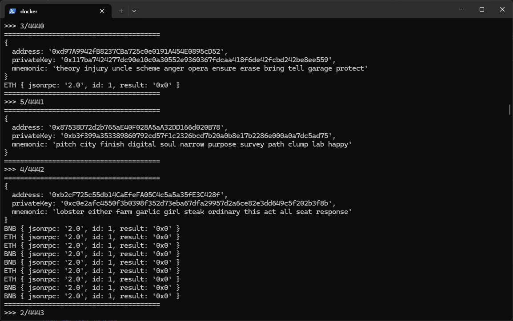

# Lucky Wallet EVM

- Generate wallets based on random mnemonic phrase with no hope.
- For PoC purposes only.



# Setup

- ENV: `.env`
- Using `RPC endpoint` or `Block Explorer (Etherscan/Bscscan)` for discovery wallet's balance, See `main.mjs > CONFIGS`.

# Get Started

- Pure NodeJS

```bash
# install depends
yarn
# run
node main.mjs
```

- Docker

```bash
docker-compose up --build
```

# Maintainer

- ThinhHV <thinh@thinhhv.com>
